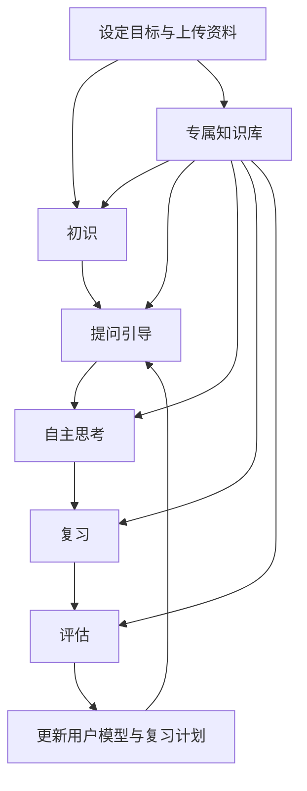
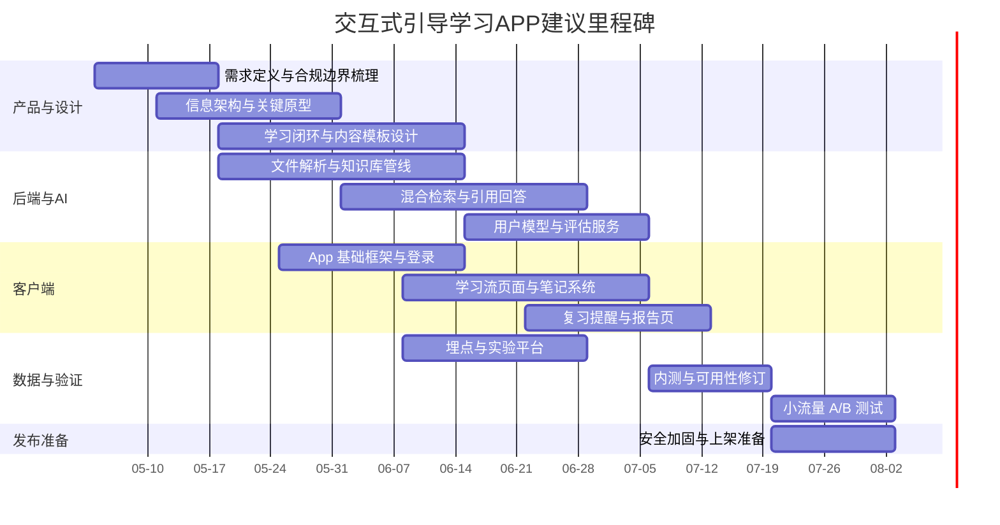

# 交互式引导学习APP分析与设计报告

## 执行摘要

这类产品不应把“大语言模型 + 问答”直接等同于“学习”。从学习科学看，学习者常常高估重读、划线、直接看答案的价值，而低估练习测试、间隔复习、自我解释等更有效但更“费劲”的策略；在公开综述与元分析中，**分布式练习**与**练习测试**整体支持度最高，自我解释与精细化提问也具有稳定但更依赖场景与实施方式的效果。因此，交互式引导学习 APP 的核心目标，不应是“最快给答案”，而应是把**提问、回忆、解释、反馈、复习**做成默认学习路径。与此同时，联合国教科文组织对生成式 AI 教育应用的原则同样强调：设计必须以人为本、保留学习者控制权、匹配年龄与学习目标，并通过试点和评估验证长期效果。citeturn12view2turn34view0turn23view0turn12view4turn5search0

基于上述证据，本报告建议将产品定义为：**资料驱动的 AI 学习教练**，而不是单纯聊天机器人。它应围绕五段学习闭环展开：**初识、提问引导、自主思考、复习、评估**。在技术上，建议优先采用**用户上传文件 + 检索增强生成**的路线而不是直接把用户资料拿去做模型训练；RAG 的学术出发点正是为了解决纯参数模型在知识来源可追溯性、知识更新与事实性上的限制。检索层建议采用**向量检索 + 关键词检索 + 元数据过滤 + 重排**的混合方案，因为精确术语、日期、姓名、代码、题号等信息往往不能只靠语义向量解决。citeturn24view0turn4view5

如果产品计划在中国内地上线，隐私与合规不能后补。按照《个人信息保护法》，个人信息处理需要明确合理目的、与目的直接相关、坚持最小必要和公开透明；《生成式人工智能服务管理暂行办法》要求训练与服务过程中的数据来源合法、涉及个人信息时应取得同意或满足法定条件，并提高数据真实性、准确性、客观性与多样性；《算法推荐管理规定》要求向用户提供**不针对其个人特征的选项**或便捷的关闭个性化推荐选项，并支持选择或删除用于推荐的用户标签；若面向未成年人，还需要履行更严格的未成年人保护义务。citeturn18search0turn20search1turn16search1turn16search2turn21search0turn3search3

商业上，这类产品更适合采用**免费建立学习习惯，付费解锁深度与效率**的设计，而不是首版就把核心学习内容完全锁在订阅后。公开披露材料显示，Duolingo 将“免费访问学习内容、对附加功能收费”的 freemium 模式视为实现大规模增长的核心，并把“更好的学习效果—更强口碑—更多用户—更多数据与产品投入”作为增长飞轮的一部分。对本产品而言，这意味着：首版最值得投资的不是大而全内容库，而是**引导学习闭环、私有知识库体验、评估回路、复习调度**。citeturn25view1turn25view0

## 产品目标与用户画像

由于题目**未指定**产品学科、市场区域、预算、面向人群年龄层、ToC/ToB 优先级与是否进入正式校内场景，本报告按“**中国内地合规优先、ToC 首发、文本型/阅读型/题解型学习优先**”进行建议性设计；凡必须依赖业务输入才能确定的事项，以下均标注为“未指定”。这一假设的原因是：文本资料上传、检索增强、结构化提问、练习测试与间隔复习，更容易在成人学习、高校课程、考证与职场进修场景中快速闭环；而若一开始就进入未成年人、校内正式评价或高风险升学场景，内容审核、责任边界与未成年人保护要求会明显上升。citeturn5search0turn3search3turn21search0

| 定位项 | 当前状态 | 报告中的建议性处理 |
|---|---|---|
| 产品总体目标 | 未指定 | 设计为“AI 引导式学习教练”，重点不是代答，而是促进理解、回忆、解释与复习 |
| 首发学科/内容域 | 未指定 | 优先文本型与题解型领域，如语言学习、考证、大学课程、职场技能、阅读密集型学科 |
| 首发市场 | 未指定 | 建议 ToC 先行，后续再扩展到班级/机构版 |
| 目标年龄层 | 未指定 | 建议首版优先高中后学习者与成人学习者；K12 需单独增强未成年人合规 |
| 项目预算 | 未指定 | 货币预算保持“未指定”；实施部分提供人时估算 |

如果将产品目标总结成一句话，建议是：**把“我会问 AI”升级成“AI 带我学会”**。这一定义与学习科学是一致的。已有研究一再表明，学生并不会天然选用最有效的学习技术；有效策略往往需要被产品化为默认路径、模板与提醒，否则用户极容易退回到“看答案—似懂非懂—很快遗忘”的模式。citeturn12view2turn34view0turn23view0

| 目标用户群 | 典型使用场景 | 核心需求 | 主要痛点 | 首发优先级 |
|---|---|---|---|---|
| 高校课程学习者 | 课件、论文、教材、课堂笔记并行学习 | 先建立知识框架，再针对难点提问，最后形成可复习材料 | 资料分散、课上听懂课后不会复述、复习无节奏 | 高 |
| 考证/考试型学习者 | 法考、教资、语言考试、资格认证 | 快速定位考点、做题、错题回看、延迟复习 | 看得多做得少、做题后不复盘、弱点长期重复出现 | 高 |
| 职场技能进修者 | 阅读内部文档、课程、报告、操作手册 | 从资料中抽技能树、用 AI 做陪练、形成工作可迁移知识 | 时间碎片化、输入多输出少、难长期坚持 | 高 |
| 阅读密集型自学者 | 读书、读论文、读长文、做主题式学习 | 读前建立问题、读中形成笔记、读后可自测可回顾 | 容易“读完即忘”、缺少提问与输出环节 | 高 |
| 教师/辅导者 | 上传教学资料、给学生布置引导任务 | 批量生成阶段任务、复习题、讲解提纲 | 内容准备耗时、难给不同学生差异化支架 | 中 |

这些画像背后的共同痛点不是“没有内容”，而是**不会把内容转化为长期可提取的知识**。因此，产品的差异化不应主要来自“内容数量”，而应来自：能否把用户资料变成专属知识库、能否把有效学习技术嵌入流程、能否把用户从“消费答案”转向“形成解释”。citeturn23view0turn12view4turn34view0

## 学习流程与功能模块

联合国教科文组织建议，生成式 AI 在教育中的应用应服务于人类需要、由人控制、匹配学习目标与年龄，并纳入具体的试点与评估。结合检索练习、间隔练习、自我解释、SQ3R、Cornell 与番茄工作法，本报告建议把 APP 的主学习流设计成一个固定但可自适应的五阶段闭环。citeturn5search0turn23view0turn40view0turn39view0turn41view0

“西蒙学习法”在中文互联网里并不是一个高度统一、标准化的学术术语。为避免歧义，本报告把它**产品化操作定义**为：**目标聚焦—知识组块—持续专注—高频反馈**。其认知学基础主要借鉴 Simon 相关的组块研究，以及智能辅导系统中常用的掌握度追踪思路，而不是把“西蒙学习法”视为一套存在统一官方版本的独立理论。citeturn33view0turn23view1

| 学习阶段 | 目标 | 大语言模型如何调用 | 用户上传文件与专属知识库如何参与 | 学习法嵌入方式 | 关键产物 |
|---|---|---|---|---|---|
| 初识 | 建立“这门内容在讲什么”的整体图景，识别先修知识与难点 | 先做目标澄清、难度诊断、5题内预评估，再生成知识地图与学习顺序；默认不给完整长答案，而给结构化导航 | 上传 syllabus、教材、课件、笔记、过往错题；系统抽目录、章节、术语表、题型表，建立课程空间 | **SQ3R-Survey**：先看目录/标题/图表；**西蒙**：把主题拆成 4–8 个知识组块；**番茄**：生成本次 25 分钟微目标 | 知识地图、先修清单、首周计划 |
| 提问引导 | 把“看内容”变成“带着问题学” | 进入苏格拉底式问答：先问用户，会了再升难；不会时先给提示，再给半答案，最后才给完整解释 | 对每次提问都先检索课程空间的相关片段；优先引用用户资料里的表达与老师术语 | **SQ3R-Question**：把标题改成问题；**费曼**：要求用户先用自己的话说；**康奈尔**：自动生成提示词/线索栏 | 问题清单、提示问题、概念解释草稿 |
| 自主思考 | 让用户真正做题、解释、推导、比较，而不是被动抄答案 | 启用“思考优先”模式：要求先作答，再按层级给线索；对用户回答做错误归因、概念纠偏与对比讲解 | 从知识库提取定义、例题、标准表达、反例；仅在用户卡住时显示引用片段 | **费曼**：面向“小白/同学/未来自己”解释；**西蒙**：按组块逐个攻克；**番茄**：单轮只做一块内容 | 用户自己的解释、错因标签、提示链 |
| 复习 | 让知识在时间维度上被再次提取，而不是仅保存在“当时看懂” | 自动生成抽认卡、简答题、闭卷回忆任务、错题回放；根据遗忘风险安排复习时间 | 知识库中的高频概念、错题、用户笔记会被再加工成复习包 | **SQ3R-Recite/Review**；**康奈尔**：遮住笔记只看提示词回忆；结合**练习测试**与**分布式练习** | 复习卡片、错题集、下次复习日程 |
| 评估 | 判断“会不会、稳不稳、会不会迁移” | 用结构化输出给出掌握度、信心偏差、薄弱点、下一步建议；必要时回到提问引导阶段 | 题目优先从用户课程资料与既有错题中抽样，避免评估脱离语境 | **练习测试**为主，配合反思与延迟测验；输出“掌握度—证据—建议”三联报告 | 评估报告、掌握度图、阶段晋级建议 |

上表的设计逻辑，直接对应了当前学习技术研究中最有价值的几类方法：**分布式练习**与**练习测试**是高支持度技术；**自我解释**与**精细化提问**是中等支持度技术；而 SQ3R 与 Cornell 则分别提供了“读前—读中—读后”的流程模板与“记录—提问—复述—反思—复习”的笔记模板。Pomodoro 则把执行阻力降到足够低，使“开始学”这件事更容易发生。citeturn34view0turn23view0turn12view4turn39view0turn40view0turn41view0

下面给出可直接落地到产品中的**对话模板**。这些模板不是固定答案模板，而是**交互骨架**，适合做 Prompt、对话组件或练习卡片模板。

| 方法 | 交互模板示例 |
|---|---|
| 费曼 | **AI**：先别看答案。请你用不超过 120 字，向一个初中生解释“机会成本”。**用户**：…… **AI**：我先不纠正全文，只标出三个可能没讲清的点：放弃的最佳备选、显性成本、隐性成本。你想先补哪一个？ |
| 西蒙 | **AI**：把“线性代数入门”拆成四个组块：向量、矩阵、线性变换、特征值。今天只学第一块。25 分钟里只完成两个微目标：看懂向量几何意义，完成两道基础题。中断时请记录原因。 |
| SQ3R | **AI**：先不要通读第 3 章。请只看标题、小标题、图表和章末问题，然后写出你最想搞懂的 3 个问题。**用户**：…… **AI**：很好，现在带着这 3 个问题进入正文。 |
| 番茄 | **AI**：现在开始一个 25 分钟专注块。本轮任务只有一件事：读完第 2 节并写出 5 个关键词。期间如果被打断，请点“被打断”而不是切出去。5 分钟休息后我会让你闭卷回忆。 |
| 康奈尔 | **AI**：右栏请记录“事实、定义、例子”；学习完成后，我会基于右栏自动生成左栏提示问题与底部摘要。复习时你只看左栏，尝试口头说出右栏内容。 |

如果希望产品真正“引导”而不是“代劳”，一个很重要的交互原则是：**除非用户主动请求直接讲解，或者系统检测到连续受挫，否则默认先让用户回答，再给提示，再给讲解**。这既符合 UNESCO 所强调的“人类控制与适切教学互动”，也符合自我解释、检索练习与延迟保持的研究方向。citeturn5search0turn12view4turn23view0turn1search1

## 技术方案

从技术架构上看，这类产品最稳妥的路线不是“让模型记住所有用户文件”，而是围绕**私有知识库 + 混合检索 + 分阶段编排器**来设计。RAG 的经典问题意识就是：纯参数模型的知识虽然丰富，但在知识来源可追溯、动态更新与事实一致性方面存在限制；而混合搜索之所以重要，是因为语义向量与关键词检索擅长的检索类型并不相同。Azure AI Search 的官方文档明确指出，混合搜索通过并行执行全文与向量查询，再用 RRF 融合结果，可以同时兼顾“概念相似”和“精确匹配”；其中产品代码、姓名、日期等实体性信息，往往更依赖关键词命中。citeturn24view0turn4view5

| 技术域 | 推荐设计 | 设计要点 |
|---|---|---|
| 知识库构建 | 文档解析 → OCR/版面理解 → 去重 → 标题感知切块 → 向量化 → 关键词索引 → 元数据表 | 保留课程、章节、页码、来源文件、上传时间、版本号、题型、难度等元数据；表格、公式与题目应尽量作为“原子块”保存 |
| 检索策略 | **BM25/全文检索 + 向量检索 + 元数据过滤 + rerank** | 对“概念理解题”更依赖语义召回，对“题号/日期/术语/法条”更依赖关键词；回答前回传引用片段，建立依据链 |
| 模型选择 | 云端主模型 + 轻量端侧模型 + 专用向量模型 | 云端负责长文本理解、推理、讲解与评估；端侧负责缓存、摘要、轻量分类、PII 初筛、弱网/离线场景；向量模型单独服务检索 |
| 推理架构 | 以云为主，端侧为辅；支持在线优先、离线降级 | 在线时用主模型完成引导学习；离线时保留本地笔记、已缓存摘要、已下载复习包与轻量问答 |
| 多轮对话管理 | “阶段状态机 + 会话记忆 + 长期用户模型”三层 | 不把所有历史都塞进上下文；只保留当前阶段必要状态、用户画像、掌握度、最近错误与可解释的学习轨迹 |
| 文件解析 | 首版建议支持 PDF、DOCX、PPTX、TXT、MD、CSV/XLSX、EPUB、JPG/PNG | 扫描版 PDF 与图片走 OCR；低质量扫描件需提示解析置信度，不要默默进入后续评估流程 |
| 数据存储与同步 | 本地缓存 + 云端主存 + 多端同步 | 本地保存最近会话、笔记、复习包与脱机状态；云端保存知识库索引、用户模型、计划与日志；做版本回放与软删除 |

以中国内地部署为例，阿里云 Qwen-Long 官方文档给出的参考能力包括：通过 `file-id` 引用上传文件进行长文档推理，最大上下文可达 **1000 万 Token**；支持 TXT、DOCX、PDF、XLSX、EPUB、MOBI、MD、CSV、JSON、BMP、PNG、JPG/JPEG、GIF 等格式；图片单文件上限 20MB，其他格式上限 150MB；单次请求最多引用 100 个文件；并支持 JSON Schema 形式的结构化输出。腾讯混元 Embedding 官方接口则提供 1024 维向量与明确的输入限制。这些厂商能力说明：首版产品完全可以基于**文件空间—索引—检索—结构化评估**的路线建立，而不必在一开始就做复杂的模型微调。citeturn14view1turn15view0turn14view2

在端侧/离线方向，Apple 已开放面向开发者的 Foundation Models on-device 能力；Google AI Edge 的 MediaPipe LLM Inference 也支持模型**完全在设备上运行**，可用于生成、检索式回答与文档摘要。这意味着：如果产品强调隐私或弱网场景，完全可以把**轻量总结、学习计划展示、局部复习问答、PII 预分类、笔记重排**等能力下沉到端侧，而把长上下文阅读、复杂讲解、评估与大规模检索留在云端。citeturn13view0turn12view7

对话管理方面，建议不要把“多轮对话”仅理解成聊天历史堆叠，而应拆成三层状态。第一层是**教学状态**，即当前处于初识、提问引导、自主思考、复习还是评估；第二层是**学习状态**，记录本轮目标、番茄倒计时、已暴露提示层级、知识点掌握概率与最近错因；第三层是**账户状态**，即用户画像、课程空间、授权与隐私配置。若要做自适应学习，掌握度层可以采用 BKT 这类成熟框架：它本质上是基于作答序列更新某个知识技能被掌握概率的模型，长期用于智能辅导系统。citeturn23view1turn26view1

就产品文件限制而言，建议**不要直接等同于底层模型的最大限制**。即便底层服务支持 150MB 文档，首版产品也宜把默认限制收得更紧，例如：单文件 20–50MB、单知识空间 20 个文件、单轮学习最多激活 10 个相关片段。这样做不是技术上做不到，而是为了控制首答时延、解析失败率、索引污染与单轮 token 成本。尤其是 Qwen-Long 这类通过 `file-id` 引用文件内容的机制，会把引用文件内容计入输入 Token，因此必须结合**分层摘要缓存、答案缓存、片段引用而不是全文反复送模**来控成本。citeturn14view1

## 个性化与评估

个性化的前提不是“知道用户喜欢什么”，而是**知道用户现在会什么、不会什么、以什么方式更容易坚持**。高等教育个性化自适应学习的综述研究显示，纳入的 69 篇研究中，**59%** 报告了学业表现改善，**36%** 报告了学生参与度提升，但同时也指出技术与时间成本是主要限制。这说明个性化是值得做的，但做法必须“轻而准”，不能一上来过度复杂。citeturn26view1

| 用户模型字段 | 数据来源 | 用途 | 自适应规则示例 |
|---|---|---|---|
| 基线掌握度 | 预评估、小测、作答记录 | 决定从哪里开始学 | 若某知识点正确率低且答题时延长，则先回到“提问引导”而不是继续新章节 |
| 知识点掌握概率 | 连续答题、错题回放、延迟测验 | 决定复习间隔与难度升级 | 基于 BKT/简化掌握模型，掌握不足的点优先进入下一轮复习 |
| 自信度偏差 | 答前自信评分 vs 实际结果 | 修正元认知偏差 | 若“高自信低正确”，增加闭卷回忆与解释任务；若“低自信高正确”，增加正反馈与少量挑战题 |
| 学习节律 | 会话时长、番茄完成率、中断原因 | 决定任务颗粒度 | 高频被打断用户默认给 10–15 分钟微单元，而不是 40 分钟长任务 |
| 资料覆盖度 | 上传文件类型、章节覆盖、解析置信度 | 决定系统可用支撑范围 | 若资料缺失严重，只给开放式引导，不输出“基于课程资料”的强结论 |
| 任务偏好 | 题目型、阅读型、讲解型、口头解释型 | 决定交互形式而非学习目标 | 对阅读型用户增加 SQ3R 与 Cornell；对题目型用户增加错题复现与简答题 |

评估指标建议分三层。第一层是**学习效果指标**：预评估到阶段评估的提升、D+1/D+7/D+14 延迟保持、检索练习正确率、自我解释质量、错因复发率。第二层是**产品行为指标**：上传后首答时长、知识空间启用率、番茄完成率、周学习完成率、D1/D7/D30 留存、复习计划兑现率。第三层是**商业指标**：免费到付费转化、ARPPU、退订率、学习效果与付费之间的相关性。之所以强调延迟保持，是因为间隔练习与检索练习的价值，恰恰主要体现在**延迟后仍能提取**，而不是“当场觉得懂了”。citeturn23view0turn1search1turn34view0

A/B 测试不应只盯转化率，也不能只看满意度。Firebase 官方文档就明确把留存、收入、互动等作为 A/B 的关键指标，并支持针对不同用户群体运行实验；微软的在线实验经验则强调，受控实验是评估新功能真实行为影响的可靠方式。对学习产品而言，还应把**学习效果**纳入实验主指标或至少纳入 guardrail。citeturn12view5turn23view2

| A/B 实验主题 | A 方案 | B 方案 | 主指标 | 护栏指标 |
|---|---|---|---|---|
| 引导深度 | 先提问再提示 | 先讲解后提问 | D7 延迟正确率 | 会话放弃率、满意度 |
| 复习节律 | 1-3-7 分布式复习 | 固定每周复习 | D14 保持率 | 通知关闭率 |
| 文件建库时机 | 注册即引导上传 | 第一次受挫后再引导上传 | 上传转化率、知识空间启用率 | 首次使用时长 |
| 康奈尔支持 | 自动生成提示栏与摘要 | 只给自由笔记 | 闭卷回忆正确率 | 记笔记完成率 |
| 番茄颗粒度 | 25+5 默认 | 10+2 默认 | 单次完成率 | 次日回访率 |

评估过程里，建议把 LLM 只用作**结构化评分器与反馈生成器**，而不是唯一评判者。Apple 在其 Foundation Models 公开技术说明中，多次强调产品评估需要人类评审、对抗性测试与安全性探测；因此，APP 的掌握度评估最好采用“规则/统计分 + LLM 反馈 + 小样本人审校准”的三层结构。这样既能规模化，又能降低“模型评分漂移”对用户造成的误导。citeturn13view0

## 隐私合规与安全

如果产品支持用户上传讲义、课件、论文、工作文档、个人笔记甚至内部文件，那么隐私、版权与数据边界就是核心约束，而不是附属约束。《个人信息保护法》要求处理个人信息具有明确合理目的、与处理目的直接相关、采取对个人权益影响最小的方式，并坚持公开透明；《生成式人工智能服务管理暂行办法》要求数据来源合法、不得侵害知识产权，涉及个人信息时应取得同意或满足法定条件；《算法推荐管理规定》要求提供非个性化选项或便捷关闭算法推荐，并支持管理相关用户标签。citeturn18search0turn16search1turn16search2

| 议题 | 法规/依据 | 产品控制建议 |
|---|---|---|
| 目的明确、最小必要、公开透明 | 《个人信息保护法》强调明确合理目的、最小必要与公开透明。citeturn18search0turn20search1 | 把“建库辅导”“生成复习题”“个性化推荐”“效果分析”拆分成可单独说明和授权的目的，不要一份总同意覆盖全部 |
| 敏感个人信息处理 | 全国人大相关解读明确：生物识别、特定身份、医疗健康、金融账户、行踪轨迹等属敏感个人信息，处理要有特定目的、充分必要性、严格保护措施，并应开展影响评估。citeturn21search0 | 默认开启敏感信息识别与脱敏；对身份证号、银行账号、医疗信息、行程等进行遮蔽或上传劝退；必要时只在本地处理 |
| 用户上传文件的权利与版权 | 《生成式人工智能服务管理暂行办法》要求数据与基础模型具有合法来源，不得侵害知识产权；涉及个人信息应取得同意或符合法定情形。citeturn16search1 | 上传前增加确认框：“我有权上传并授权平台仅为学习目的处理该资料”；默认不把用户资料用于基础模型训练 |
| 个性化推荐与标签 | 《算法推荐管理规定》要求提供不针对个人特征的选项或关闭算法推荐选项，并可选择或删除用户标签。citeturn16search2 | 提供“个性化学习路径 / 标准学习路径”切换；在设置页展示当前影响路径的标签，如“易中断”“阅读偏好”“高自信低正确”并允许关闭 |
| 未成年人 | 《未成年人网络保护条例》已施行；全国人大相关解读也强调不满十四周岁未成年人个人信息应严格保护。citeturn3search3turn21search0 | 若面向未成年人，必须加入监护人同意、未成年人模式、内容分级、夜间限制、弱商业化与更严格的数据最小化 |
| 数据跨境 | 数据出境安全评估、标准合同与 2025 年《促进和规范数据跨境流动规定》共同构成跨境提供数据的重要制度基础。citeturn22search0turn22search1turn22search2 | 若调用境外模型或跨境存储，需在架构上区分境内外租户，完成数据流梳理与适用机制判断；保守方案是中国用户优先使用境内推理与境内部署 |
| 传输与存储安全 | OWASP MASVS 将数据静态存储、加密、网络通信与隐私控制列为移动应用核心控制域；英国 NCSC 明确要求保护 data at rest 与 data in transit，并强调密钥安全存储与可删除能力。citeturn37view0turn37view1 | 传输全程 TLS；静态数据加密；密钥放在系统安全存储/TEE/Keychain；租户隔离、按课程空间授权、支持导出与删除 |
| 文档注入与模型安全 | OWASP 将 Prompt Injection 列为 LLM 应用顶层风险，并指出 RAG 与微调不能彻底消除此类风险；Microsoft 也指出第三方文档中的间接提示注入可能导致未授权操作或数据泄露。citeturn42search0turn42search2 | 把“文档内容”与“系统指令”硬隔离；引用片段进入模型前做清洗与风险扫描；高风险工具调用一律不由文档内容直接触发 |

针对用户上传文件，建议采取以下组合策略。第一，**默认私有**：上传资料仅属于用户自己的课程空间，除非显式共享，不进入公共语料。第二，**默认不训练**：用户资料不作为底座模型再训练语料，只用于当前用户或其明确授权范围内的检索与生成。第三，**精细化删除**：支持删除单文件、删除知识空间、删除会话历史、删除个性化标签，并在 UI 上明确删除影响范围。第四，**高风险文件劝退**：若系统侦测到合同、身份证明、财务流水、病历、内部商业秘密等内容，应优先推荐“本地摘要 / 只做脱敏后上传 / 不建议上传”。这些做法并不只是“更谨慎”，而是能显著降低合规与品牌风险。citeturn18search0turn21search0turn22search0turn37view1

## 商业模式、运营与实施计划

付费逻辑上，最不建议的做法是把“基本学习内容”全部藏到付费墙后面。公开资料显示，Duolingo 把 freemium 视为实现规模增长的核心，并明确表示不把学习内容置于付费墙之后；同时，它把“学习飞轮”和“投资飞轮”都建立在**更好的教学效果、更多口碑增长、更多用户数据以及进一步产品投入**之上。对交互式引导学习 APP 而言，这意味着：**免费层负责培养学习习惯与验证价值感，付费层负责提供更深的个性化、更强的资料能力与更高效的复习闭环**。citeturn25view1turn25view0

| 档位 | 功能边界建议 | 价格 | 说明 |
|---|---|---|---|
| 免费版 | 每日有限引导会话、1 个知识空间、基础笔记、基础复习提醒、有限次文件上传 | 未指定 | 用于形成习惯与验证“上传资料后真的更会学” |
| Plus 订阅 | 无限引导会话、更多文件与空间、错题本、Cornell 自动生成、间隔复习、阶段评估报告 | 未指定 | 最核心订阅层，卖“学习效率和稳定坚持” |
| Pro 订阅 | 多课程管理、深度报告、考试模式、长文档批量建库、导出学习档案、离线复习包 | 未指定 | 面向高频进修者与重度考证用户 |
| 家庭/小组版 | 多人共享课程空间、共同复习、学习周报 | 未指定 | 适合亲子/同学/同事共同学习 |
| 机构版 | 课程模板、班级空间、教师/管理员报表、权限控制 | 未指定 | 建议在 ToC 验证后再做 |

运营重点不应只是“多来几次”，而应是“来了以后是否真的发生了学习转化”。因此 KPI 应至少包括五组：**学习效果**（预后测提升、D7/D14 保持率）、**活跃与留存**（D1/D7/D30、周活、连续学习天数）、**闭环完成**（上传率、建库成功率、复习兑现率、评估完成率）、**商业**（试用转付费、续费、退订）与**风险**（投诉率、解析失败率、合规事件数）。其中，首版最关键的不是 ARPU，而是三个“首感知指标”：**上传到首个有效回答的时间、第一次复习是否按时发生、第一次评估是否让用户感到“比单纯问 AI 更值”**。citeturn12view5turn25view1turn25view0

**增长与留存策略**建议围绕三个飞轮来做。其一是**资料飞轮**：用户上传得越多，回答越贴近课程语境，价值感越强，继续上传的动力越大。其二是**复习飞轮**：越多延迟复习发生，用户越能感到“以前会忘，现在能记住”，从而形成回访。其三是**解释飞轮**：用户自己能说出来、能写笔记、能做对题，才会形成可见进步。需要注意的是，像连续签到这类游戏化机制，只能做辅助，不能代替学习效果本身。citeturn25view1turn34view0turn23view0

**MVP 功能清单**建议控制在以下范围，避免首版做成“万能 AI 校园平台”：

| MVP 功能 | 是否建议首版上线 | 原因 |
|---|---|---|
| 目标设定与预评估 | 是 | 决定学习起点与路径 |
| 文件上传与专属知识空间 | 是 | 形成核心差异化 |
| 五阶段学习闭环 | 是 | 体现“引导式学习”而非代答 |
| 基础混合检索与引用回答 | 是 | 保证答案可回溯、可贴合资料 |
| Cornell 自动提示栏/摘要 | 是 | 低成本高价值的结构化输出 |
| 复习日程与错题回放 | 是 | 形成长期留存基础 |
| 结构化评估报告 | 是 | 支撑效果感知与后续个性化 |
| 多人协作/社区 | 否 | 会显著增加内容治理成本 |
| 复杂课程市场/内容商城 | 否 | 首版不应分散焦点 |
| 语音对话、拍照批改、多模态讲解 | 条件性 | 可作为二期增量，而非首版刚需 |

下面给出建议性的 16 周开发甘特图。这里的**时间线是建议值，不是既定承诺**；用户未给出团队成熟度、既有代码资产与预算，因此只能作为中等复杂度项目的参考排期。

**团队与工时/成本**方面，用户没有给出地域、薪酬口径与是否自研底模，因此**货币成本：未指定**。但可以给出建议性人时范围：

| 角色 | 建议配置 | 建议投入 | 估算人时 |
|---|---|---|---|
| 产品经理 | 1 人 | 全程 | 450–650 |
| 交互/视觉设计 | 1 人 | 前中期为主 | 280–420 |
| iOS/Android 或跨端工程师 | 2 人 | 全程 | 900–1,300 |
| 后端工程师 | 1–2 人 | 全程 | 700–1,000 |
| LLM/检索工程师 | 1 人 | 中前期至中后期 | 450–700 |
| 数据/实验分析 | 0.5 人 | 中后期 | 120–220 |
| QA | 1 人 | 中后期 | 250–400 |
| 学习设计/内容策略 | 0.5–1 人 | 前中期 | 180–320 |
| 安全/法务支持 | 兼职 | 定期评审 | 40–120 |

按上表粗略汇总，MVP 阶段建议准备 **3,400–5,100 人时**。若底层采用 Qwen-Long 一类按 Token 计费的服务，需要把推理成本独立核算，因为其文件上传/解析可以不单独收费，但文件内容会在调用时计入输入 Token；这会直接影响“全文扔给模型”是否经济，因此首版应优先做**摘要缓存、检索片段化、相似问答缓存**。citeturn14view1

## 风险与应对

这类产品的主要风险，不在于“模型够不够聪明”，而在于**学习逻辑是否正确、资料边界是否清楚、推荐是否可解释、成本是否可持续**。如果这四件事做偏了，产品可能短期看起来很“惊艳”，长期却既教不好也留不住。citeturn5search0turn34view0turn25view1

| 风险类型 | 典型表现 | 影响 | 缓解措施 |
|---|---|---|---|
| 技术风险：幻觉与错误讲解 | 模型把资料里不存在的内容“补全”，或在评估时给出不可靠反馈 | 破坏信任，误导学习 | 采用 RAG + 引用回答；对评估报告使用结构化输出；高风险结论需给出处与置信度；抽样人工复核 citeturn24view0turn14view1turn13view0 |
| 技术风险：过度代答 | 用户不思考，直接拿答案 | 短期满意，长期无效 | 默认“先答后讲”；设置提示层级；把解释、复述与练习测试做成默认流程 citeturn12view4turn23view0turn34view0 |
| 技术风险：Prompt Injection/文档注入 | 用户上传资料中含有恶意指令，影响模型行为 | 可能导致越权、泄漏、错误执行 | 指令与数据硬隔离；上传内容清洗与风险扫描；高风险工具调用不接受文档直接驱动 citeturn42search0turn42search2 |
| 技术风险：检索失准与 OCR 失败 | 扫描件识别差、章节切块不当、关键词漏召回 | 用户觉得“明明上传了却回答不对” | 对低置信度解析结果显式提示；保留原页跳转；标题感知切块；混合检索而非纯向量检索 citeturn4view5turn15view0 |
| 产品风险：留存靠噱头而非学习效果 | 用户前几天觉得新鲜，后续不复习、不回访 | 获客浪费，付费难成立 | 把复习、评估和进步可视化做成主价值；优先优化 D7/D14 保持与复习兑现率 citeturn23view0turn25view0 |
| 商业风险：成本失控 | 长文件反复送模、评估频次过高、缓存不足 | 毛利被推理成本吞噬 | 做分层摘要缓存、片段检索、相似问题缓存；把大模型留给高价值环节 citeturn14view1 |
| 合规风险：敏感资料泄露 | 用户上传合同、病历、身份证明或企业秘密 | 法律与声誉双重风险 | 默认私有、默认不训练、敏感信息识别与脱敏、可删除与审计追踪 citeturn21search0turn18search0turn37view1 |
| 合规风险：个性化路径不透明 | 用户不知道为何被推荐某条路径或某类内容 | 可能触发投诉与监管关注 | 提供标准路径/个性化路径切换；展示当前影响推荐的标签，并允许删除或关闭 citeturn16search2 |
| 合规风险：跨境与未成年人 | 调用境外模型、面向未成年人却无专门模式 | 风险暴露大 | 中国用户优先境内推理；跨境前做数据流与机制判断；未成年人单独产品模式 citeturn22search0turn22search1turn22search2turn3search3 |

**开放问题与局限**：题目没有给出首发学科、目标地区、预算口径、是否服务未成年人、是否允许组织/学校场景、是否包含正式考试与评分用途，因此本报告把这些项目中无法唯一确定的部分明确标注为“未指定”，并采用了“成人与高中后学习者、文本型学科、资料驱动私有知识库、先 ToC 后机构”的建议性假设。若你的真实目标是 **K12 校内正式评价、重多模态拍照批改、或面向企业内部知识训练**，则合规边界、模型选型、内容审核与实施人力都需要相应上调。